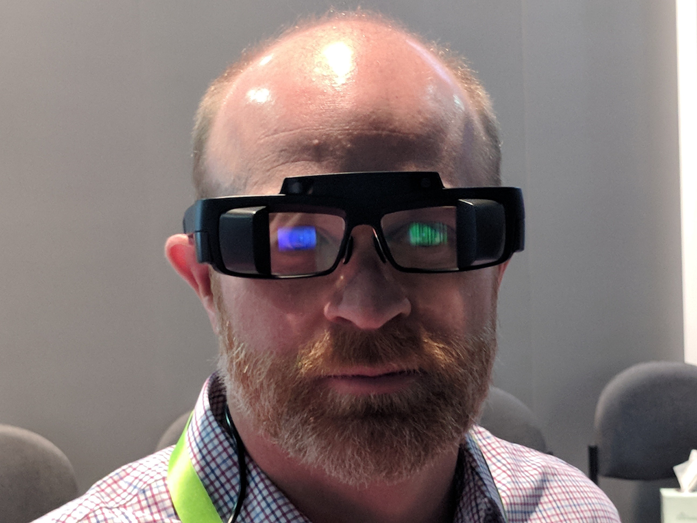
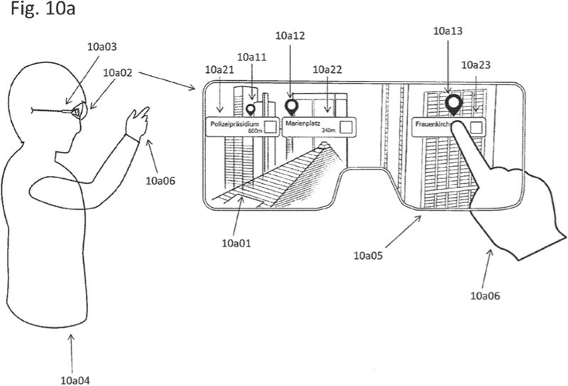
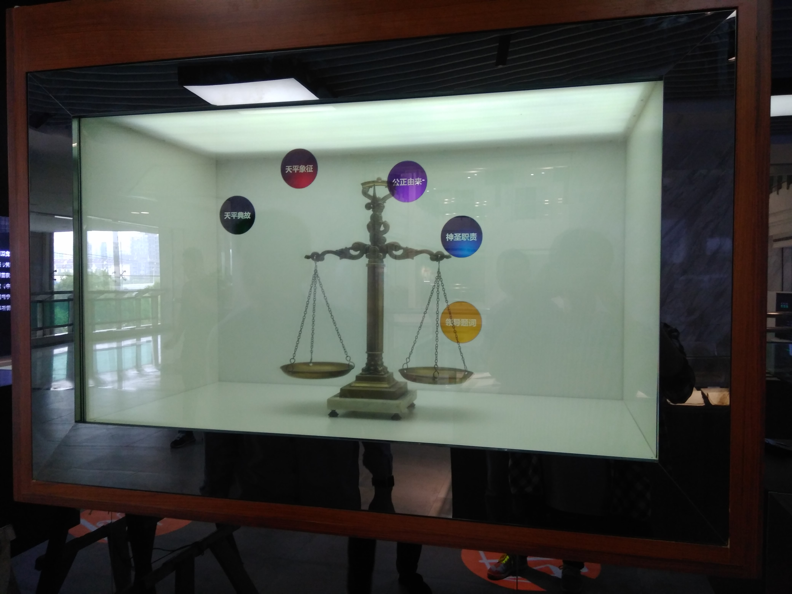
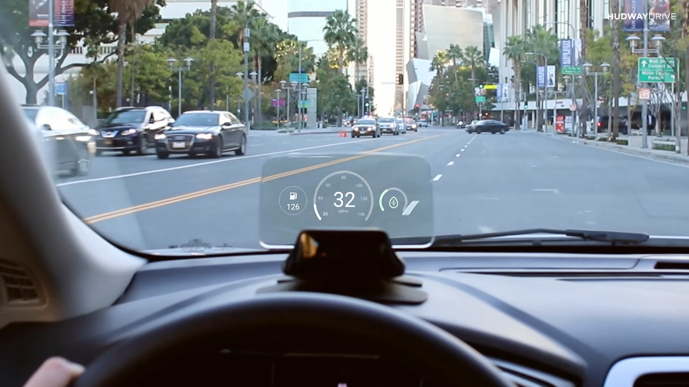
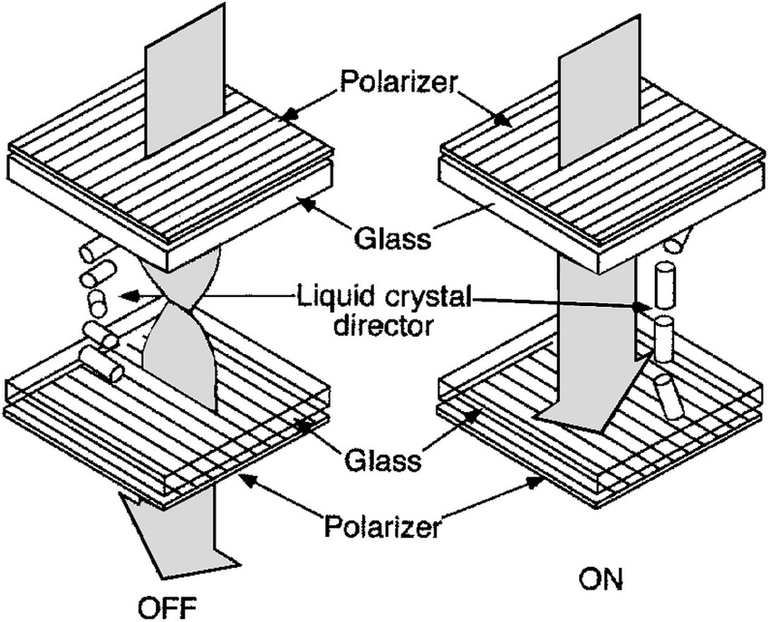
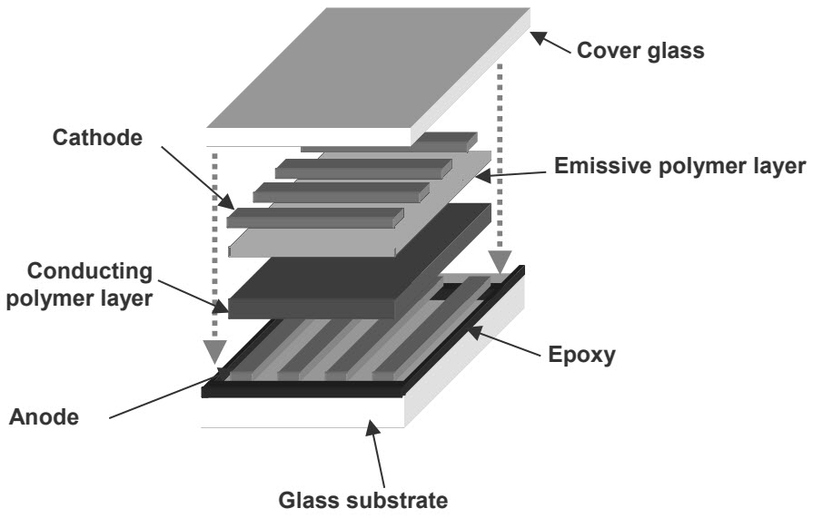

---
title:
- CSC 460
subtitle:
- Transparent and Touchscreen Displays
author:
- Daniel Frankcom
fontsize:
- 12pt
---

#### Note: this report is a work in progress, and will likely change as milestones are added.

# History

## Introduction

Transparent display technology, like many other technologies, began in a series of research labs under small-scale and controlled projects. Originally such technology was not for commercial or consumer purposes, but as the manufacturing and material properties of the displays have evolved, they have begun to move into those markets.

The technology to produce these displays is not particularly new, "[in] 2011 Samsung became the world's first company to mass produce transparent LCD panels." [1] Advancements in opaque OLED technology, combined with years of research and manufacturing practice has resulted in larger and more reliable transparent displays that can be sold to commercial customers, and perhaps soon to consumers.

## Research

Contributions from various research teams have contributed to the overall knowledge base that has produced these transparent displays. Below are some examples of technological steps forward that have contributed to the current state of this technology.

### Transparent Electronics

A paper from December 2009 [2] discussed a new type of "transparent thin-film-transistors (TFTs)" [2] which are a crucial component in building OLED panels. When attempting to build a fully transparent display, every opaque component reduces the amount of light that can come through the surface, so creating transparent TFTs allows more light to come through these components.

### Single Colour Plastic Coating

In 2014 researchers from MIT created a thin plastic film that could be applied to a piece of glass to provide a highly transparent, single-colour display. In contrast, produced transparent displays at the time were "directly integrated into the glass: organic light-emitting diodes for the display, and transparent electronics to control them. But such systems are complex and expensive, and their transparency is limited." [2] 

## Summary

Transparent display technology uses many of the same concepts discovered and refined for the opaque LCD and OLED markets. Transparency was not discovered and produced by any single entity, instead the technology is a result of years of research and refinements to this existing technology. Existing components used to build LCD and OLED screens could be made smaller, enlarging the transparent space between them, and some of these components could be made transparent themselves. As more light is able to come through the display service, the transparency of the device improves.

## Sources

[1] https://www.jcdecaux.com/blog/transparent-lcd-technology-out-home-first

[2] https://www.researchgate.net/publication/224079766_Transparent_electronics_for_see-through_AMOLED_displays

[3] https://news.mit.edu/2014/seeing-things-a-new-transparent-display-system-could-provide-heads-up-data-0121

# Applications

## Augmented Reality

In recent years, augmented and virtual reality systems have been gaining traction with the gradual improvement of relevant technologies [1]. While virtual reality attempts to take over a user's entire field of view to provide an immersive experience, augmented reality takes a gentler approach by blending the real world with the manufactured. This is a great application for transparent displays, as content can be overlayed in front of the user's vision, while still allowing light from the environment through the display. The figure below shows an example pair of augmented reality glasses, where the man's face can be seen through the glass around the content that is being displayed.

Other approaches prior to the introduction of transparent displays attempted to use a camera to capture the user's environment, modify it, and then deliver it to the user on an opaque display. This method of content delivery was unpopular due to the inherently latency problems, field of display restriction, and power consumption. In contrast, when a transparent display is not needed, it effectively disappears due to its transparency. The user of the device is unaffected, and maintains a full field of view with no latency. The figure below shows a patent obtained by Apple which involves overlaying mapping information for a user in real-time, to aid in city navigation.

[1] https://www.idc.com/getdoc.jsp?containerId=prUS44511118

[F1] https://miro.medium.com/max/2592/1*AcbWxGO7OuLMk6OMirkfuA.jpeg

[F2] https://www.patentlyapple.com/.a/6a0120a5580826970c01b8d2e6ed75970c-pi

## Retail Showcases

Another popular application of transparent display technology is product showcases. Retail stores are a particularly early adopter of the technology, as it allows for the display of a product with an overlayed and sometimes interactive media element.

This product display method is applicable to "showcase boxes" as depicted in the figure above, as well as entire store windows as depicted by figure below. Due to the composability of these displays, media showcase elements can be constructed taking up any amount of space or any shape.

[F3] http://www.displaysky.com/images/up_images/201751162248.jpg

[F4] http://www.yipled.com/uploads/20160929/1475145340672598.jpg

## Head-up Display

Head-up displays are often considered as a subcategory of augmented reality, however there is an important distinction between the two. Augmented reality systems blend real with virtual elements, whereas head-up displays merely "[present] data without requiring users to look away from their usual viewpoints" [1].

Examples of data presentation where it is important for the user to remain focused on their main task often involve vehicles. The figure below shows a head-up display mounted to car dashboard, which is displaying speed and fuel data for the user. A display like this can be useful as it prevents the need for the user to take their eyes off the road to glance down at the instruments behind the wheel. The display itself is transparent so that the driver's field of view is not reduced, and hazards can be seen behind the display.

A more futuristic example is shown in figure below, where a head-up display is mounted to a motorbike helmet, so that the user can see their speed while maintaining their line of sight on the road. The technology shown in this image is more compact and low-powered (assuming it runs from a battery), however the core technology here is the same between these applications.

[1] https://en.wikipedia.org/wiki/Head-up_display

[F5] https://sk.ru/cfs-file.ashx/__key/communityserver-blogs-components-weblogfiles/00-00-00-00-03/live-1.png

[F6] https://www.kesato.com/blog/wp-content/uploads/2014/11/BikeHUD-Adventure-Helmet-1.jpg

# Transparent LCD Technology

Transparent LCD technology is one of two major categories of transparent panels that exist on the market today. While these LCD panels use an older technology than more recent OLED panels, they also make up a smaller share of the transparent display market due to some inherent limitations in the way that the technology works. [1]

LCD technology works in a similar manner for both opaque and transparent displays, so in order to discribe the function of a transparent LCD we will first examine how a traditional, opaque panel works.

## Opaque LCDs

These panels are made up of a number of layers, with the first being a strong backlight. LCD panels rely on an always-on white light at the back of the display, which illuminates the pixels which are "turned on". This has an advantage in that each pixel does not need to generate its own light, but has a disadvantage that "off" pixels can still leak some light to the user, meaning that blacks are not as dark as desired.

The backlight emitts light through the next layer, which is a horizontal polarizing filter. Polarizing filters only allow light through if it is vibrating in a specific plane, meaning that the only light coming through the second layer is vibrating in a horizontal plane. The diagram below excludes the backlight layer, but shows the second layer which is always letting through the light represented by the arrow here. [2]

The next layer of the LCD panel is a sandwich of liquid crystals between glass. These crystals have some special properties that can manipulate the vibration of light passing through them under certain conditions. As can be seen from the diagram, the crystals will rotate the light 90 degrees, making it vibrate on a vertical plane insted of horizontal. When a voltage is applied, the crystals will "untwist", and will maintain the original plane of the light.

The final layer is another polarizing filter, but this time one that is vertically aligned. The combination of this filter orientation and the properties of the liquid crystals in the previous layer allow light to be selectively blocked. If an electrical signal is applied to the crystals then the light passing through will remain horizontal, and will be blocked by the vertical polarizing filter. If a charge is then removed from the layer, the light will be twisted and will pass through the final layer of the panel.

This layered pattern is applied numerous times across the LCD display in little packages, with a number of coloured filters being applied to subsets of the stacks to produce coloured pixels. Voltage can be applied selectively to groups of 3 pixels to produce combined colours, and the amount of applied voltage can be reduced to let through a smaller amount of the backlight.

## Applying Transparency

The visibility of pixels as described in the previous section relied on the power of the backlight that is embedded in the display. In transparent LCDs, there is no backlight, and instead the visibility is depndent on the ambient light behind the display. The display layers other than the backlight in an opaque LCD are inherently transparent already, as they are designed to let the light from the backlight through to the user. If we take away that layer then we have a transparent display right away, but such a display still requires a bright light behind it in order to be seen.

Depending on the application in which such a panel is used, this requirement may already be fullfilled. For example, a product showcase box is likely to have a bright light already to light up the product on display, in which case the transparent LCD would work well. Unfortunately, a light like this does not exist in all places that a transparent display might be required, and instead a weaker light or a non-direct light source needs to be used to display the image.

Due to the inherent nature of the polarizing filters, they block a significant portion of the light passing through them. This must be accounted for when setting up a transparent LCD, as the amount of ambient light will be significantly reduced when passed through the display stack. Due to this limitation, a large focus of transparent LCD technology improvement is on increasing the transmission efficiency of these filters. If the filters were able to better allow light through, or even transform the light to be in a uniform plane, then the user would be able to see a brighter image.

[1] https://en.wikipedia.org/wiki/See-through_display

[2] https://www.explainthatstuff.com/lcdtv.html
    
[F1] https://www.researchgate.net/figure/Principle-of-operation-of-a-TN-display-in-the-normally-white-mode-Figure-adapted-from_fig2_234151598

# Transparent OLED Technology

Transparent OLED displays are the second major category of such displays. They are distinct from LCD displays because they generate their own light, rather than relying on ambient light. This makes them far more popular for many applications, as they are a self-contained unit and don't require external light. [1]

Just like with transparent LCDs, transparent OLED displays work very similarly to their opaque counterpart. We must first understand an standard OLED display, to which we will then apply transparency principles.

## Opaque OLEDs

Since OLED displays generate their own light, they do not need a backlight. Each pixel is responsible for its own light generation, so this results in much deeper blacks than LCDs due to the fact that a pixel can be electronically "off", rather than just blocking a backlight.

Like LCDs, OLED panels are made up of a number of sandwiched layers which work together to produce an image. Each pixel is made up of these same layers, with a coloured filter applied to each stack to assign it as red, green, or blue. Together these individual pixels form the array of pixels that makes up the screen.

The bottom layer in the diagram above is a glass substrate. This a solid material (usually plastic or glass) [3] that is used as a structural surface for the rest of the display layers. The top layer is a similar transparent material, however this is thinner as it is not structural and is instead present to seal the stack of layers.

Inbetween the plastic or glass layers is a anode/cathode pair. This pair of layers allows electrons to flow through the middle layers, the effect of which is discussed below. The anode/cathode layers can be electrically disabled, preventing the flow of electrons through the layers, and turning of the pixel. To improve light emission, the anode is often made out of a reflective layer, so as to reflect as much light as possible towards the user.

The layers in the middle are used to actually produce the light needed for the display. The anode positively charges the conductive layer, and the cathode negatively charges the emissive layer. In a process called "recombination" [1], the positive charge moves to the emissive layer where it meets the negative charge, cancelling out the charge but producing a "brief burst of energy in the form of a particle of light - a photon" [1].

## Applying Transparency

Since each pixel produces its own light in a transparent OLED, the display panels can be bright in any amount of ambient light. This gives the display technology a huge advantage over transparent LCDs, as they can be mobile, self-contained, and small. Unless the display will be placed in an area with a permenant backlight, or used in a bright environment, a transparent OLED is almost always a better choice than a similar LCD.

Since there is no backlight layer to remove from an opaque OLED display, when removed from a monitor/tv casing it is already somewhat transparent. The transparency of the display can be greatly improved however, by making some of the pixel layers transparent. The substrate is usually made of glass or plastic anyway, so is often transparent by default. The anode that is often made reflective so as to direct light towards the user needs to be made transparent, so that light can pass through it to the user in addition to the light generated by the emissive layer.

Another aspect that contributes to OLED display transparency is the spacing between each of the pixels. Since each pixel is largely independent, there is very little between the pixels other than electrical connections. As individual pixel light output increases, and the size of the pixels decrease, more space can be introduced between them. Since this blank space has nothing to block light, it increases the overall transparency of the OLED panel. Current technology allows for OLED displays to be "up to 85% as transparent as their substrate" [4].

[1] https://www.explainthatstuff.com/how-oleds-and-leps-work.html

[2] https://www.quora.com/How-do-transparent-display-screens-i-e-monitors-work-Would-they-be-widely-used-in-the-near-future

[3] https://www.electronicshub.org/oled-display-technology/

[4] https://electronics.howstuffworks.com/oled4.htm

[F1] https://www.electronicshub.org/wp-content/uploads/2019/05/OLED-Display-Technology-OLED-Layers.jpg

# Market Availability

As a manufacturing hotspot, China is an epicenter for purchasing transparent displays. Performing trivial searches on shopping platforms such as AliExpress, yield a lot of results when searching for "transparent display" or a similar search term [1]. Upon closer inspection however, it becomes apparent that very few of the shown displays are LCD or OLED. The majority of products showcased in the search results are actually a type of projection film, which can be used in conjunction with a standard projector to give the appearance of a floating image.

While this method of image generation is interesting, searching for terms such as "transparent LCD" or "transparent OLED" yield more focussed results [2]. In contrast to the price of projection film (~$100 per square meter), the "true" displays are significantly more expensive. Preliminary results for "transparent LCD" show a number of very tiny transparent displays that could be used for a clock, and a few genuine product showcase displays that are in the range of $1500 per quare meter [3]. A search for "transparent OLED" turns up similarly poor results, however unlike the search for LCDs, there are no available large-form tranpsparent OLEDs available. All of the results, at least on AliExpress, are small displays for prototyping or for microcontroller projects [2].

The evidence above implies that transparent OLED display technology is not yet available to consumer markets, and is likely difficult to acquire in a large formfactor even for businesses. Transparent LCD displays are possible to purchase, but are prohibitively expensive for most potential customers. Based on the current market availability, transparent displays are easiest to purchase when very small, and projection film is a better investment for large showcases such as a store window.

[1] https://www.aliexpress.com/w/wholesale-transparent-display-screen.html

[2] https://www.aliexpress.com/wholesale?catId=0&initiative_id=SB_20191122175721&SearchText=transparent+oled

[3] https://www.aliexpress.com/wholesale?catId=0&initiative_id=SB_20191122180038&SearchText=transparent+lcd
