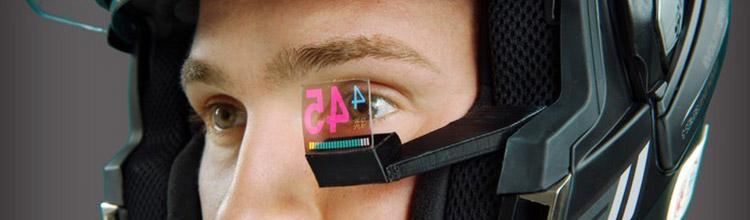

---
title:
- CSC 460
subtitle:
- Transparent and Touchscreen Displays
author:
- Daniel Frankcom
fontsize:
- 12pt
---

#### Note: this report is a work in progress, and will likely change as milestones are added.

# History

## Introduction

Transparent display technology, like many other technologies, began in a series of research labs under small-scale and controlled projects. Originally such technology was not for commercial or consumer purposes, but as the manufacturing and material properties of the displays have evolved, they have begun to move into those markets.

The technology to produce these displays is not particularly new, "[in] 2011 Samsung became the world's first company to mass produce transparent LCD panels." [1] Advancements in opaque OLED technology, combined with years of research and manufacturing practice has resulted in larger and more reliable transparent displays that can be sold to commercial customers, and perhaps soon to consumers.

## Research

Contributions from various research teams have contributed to the overall knowledge base that has produced these transparent displays. Below are some examples of technological steps forward that have contributed to the current state of this technology.

### Transparent Electronics

A paper from December 2009 [2] discussed a new type of "transparent thin-film-transistors (TFTs)" [2] which are a crucial component in building OLED displays. When attempting to build a fully transparent display, every opaque component reduces the amount of light that can come through the surface, so creating transparent TFTs allows more light to come through these components.

### Single Colour Plastic Coating

In 2014 researchers from MIT created a thin plastic film that could be applied to a piece of glass to provide a highly transparent, single-colour display. In contrast, produced transparent displays at the time were "directly integrated into the glass: organic light-emitting diodes for the display, and transparent electronics to control them. But such systems are complex and expensive, and their transparency is limited." [2] 

## Summary

Transparent display technology uses many of the same concepts discovered and refined for the opaque LCD and OLED markets. Transparency was not discovered and produced by any single entity, instead the technology is a result of years of research and refinements to this existing technology. Existing components used to build LCD and OLED screens could be made smaller, enlarging the transparent space between them, and some of these components could be made transparent themselves. As more light is able to come through the display service, the transparency of the device improves.

## Sources
#### Note: this section will be revisited for propper formatting later.

[1] https://www.jcdecaux.com/blog/transparent-lcd-technology-out-home-first

[2] https://www.researchgate.net/publication/224079766_Transparent_electronics_for_see-through_AMOLED_displays

[3] https://news.mit.edu/2014/seeing-things-a-new-transparent-display-system-could-provide-heads-up-data-0121

# Applications

## Augmented Reality

In recent years, augmented and virtual reality systems have been gaining traction with the gradual improvement of relevant technologies [1]. While virtual reality attempts to take over a user's entire field of view to provide an immersive experience, augmented reality takes a gentler approach by blending the real world with the manufactured. This is a great application for transparent displays, as content can be overlayed in front of the user's vision, while still allowing light from the environment through the display. Figure \ref{augmented-man} shows an example pair of augmented reality glasses, where the man's face can be seen through the glass around the content that is being displayed.

Other approaches prior to the introduction of transparent displays attempted to use a camera to capture the user's environment, modify it, and then deliver it to the user on an opaque display. This method of content delivery was unpopular due to the inherently latency problems, field of display restriction, and power consumption. In contrast, when a transparent display is not needed, it effectively disappears due to its transparency. The user of the device is unaffected, and maintains a full field of view with no latency. Figure \ref{apple-patent} shows a patent obtained by Apple which involves overlaying mapping information for a user in real-time, to aid in city navigation.

[1] https://www.idc.com/getdoc.jsp?containerId=prUS44511118
[F1] https://miro.medium.com/max/2592/1*AcbWxGO7OuLMk6OMirkfuA.jpeg
[F2] https://www.patentlyapple.com/.a/6a0120a5580826970c01b8d2e6ed75970c-pi

## Retail Showcases

Another popular application of transparent display technology is product showcases. Retail stores are a particularly early adopter of the technology, as it allows for the display of a product with an overlayed and sometimes interactive media element.

This product display method is applicable to "showcase boxes" as depicted in figure \ref{showcase-box}, as well as entire store windows as depicted by figure \ref{store-window}. Due to the composability of these displays, media showcase elements can be constructed taking up any amount of space or any shape.

[F3] http://www.displaysky.com/images/up_images/201751162248.jpg
[F4] http://www.yipled.com/uploads/20160929/1475145340672598.jpg

## Head-up Display

Head-up displays are often considered as a subcategory of augmented reality, however there is an important distinction between the two. Augmented reality systems blend real with virtual elements, whereas head-up displays merely "[present] data without requiring users to look away from their usual viewpoints" [1].

Examples of data presentation where it is important for the user to remain focused on their main task often involve vehicles. Figure \ref{car-hud} shows a head-up display mounted to car dashboard, which is displaying speed and fuel data for the user. A display like this can be useful as it prevents the need for the user to take their eyes off the road to glance down at the instruments behind the wheel. The display itself is transparent so that the driver's field of view is not reduced, and hazards can be seen behind the display.

A more futuristic example is shown in figure \ref{bike-hud}, where a head-up display is mounted to a motorbike helmet, so that the user can see their speed while maintaining their line of sight on the road. The technology shown in this image is more compact and low-powered (assuming it runs from a battery), however the core technology here is the same between these applications.

[1] https://en.wikipedia.org/wiki/Head-up_display
[F5] https://sk.ru/cfs-file.ashx/__key/communityserver-blogs-components-weblogfiles/00-00-00-00-03/live-1.png
[F6] https://www.kesato.com/blog/wp-content/uploads/2014/11/BikeHUD-Adventure-Helmet-1.jpg
